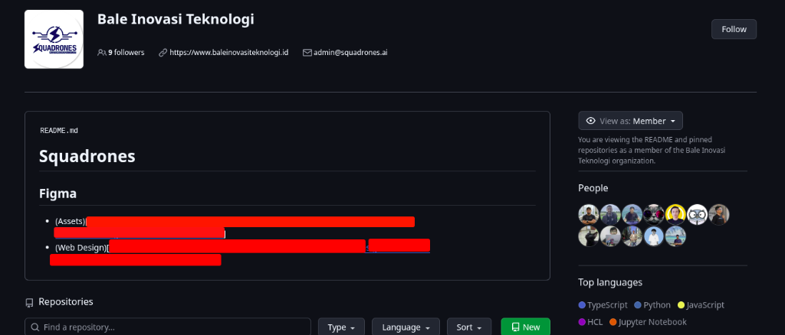
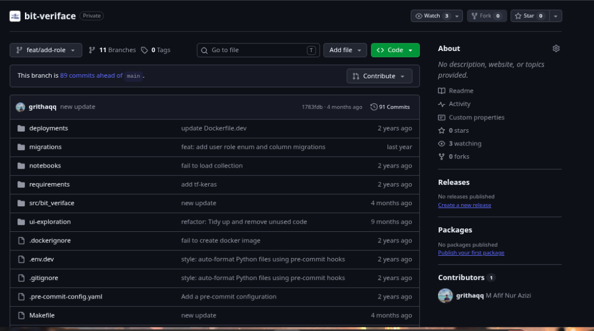

# bit-veriface_be

Welcome to the **bit-veriface_be** backend application. This guide will walk you through the steps to set up your local development environment.

## About this Project

> **Note:** This repository contains the backend source code for an application originally developed during a research and internship period at **Squadrones** approximately 2 years ago (circa 2024). 
> 
> *The original development repository and URL are kept private. This repository serves as a published version for academic and portfolio purposes.*

<details>
<summary><b>View Original Repository History Proof</b></summary>

**Organization Profile:**


**Private Repository Commit History:**


</details>


## Prerequisites

Ensure you have the following installed on your machine:
- Python (preferably 3.9+)
- [Poetry](https://python-poetry.org/docs/#installation) for dependency management
- [Docker](https://docs.docker.com/get-docker/) for running databases locally
- `bash` and `sudo` access (required for Milvus scripts)

## 1. Environment Configuration

First, set up your environment variables. A template is provided in `.env.dev`.

Copy the template to create your `.env` file:
```bash
cp .env.dev .env
```
*Note: The default values in `.env.dev` are already configured to work with the database setup instructions below.*

## 2. Install Dependencies using Poetry

This project uses Poetry to manage Python dependencies securely and efficiently.

1. Install all project dependencies:
   ```bash
   poetry install
   ```

2. Activate the Poetry virtual environment:
   ```bash
   poetry shell
   ```

## 3. PostgreSQL Database Setup

Based on the `.env.dev` file, the backend expects a PostgreSQL database running on port `5454`. The easiest way to run this locally is using Docker.

Run the following command to spin up a PostgreSQL container with the correct credentials:

```bash
docker run -d \
  --name veriface-postgres \
  -e POSTGRES_USER=admin \
  -e POSTGRES_PASSWORD=admin \
  -e POSTGRES_DB=veriface_db \
  -p 5454:5432 \
  postgres:15-alpine
```

## 4. Milvus Vector Database Setup

The project uses Milvus for facial vector embeddings. A script is provided to manage a standalone Milvus Docker container automatically using the `embedEtcd.yaml` and `user.yaml` configurations.

**Start Milvus:**
Run the provided script to start the database. It will download the necessary image, start the container, and wait until it is healthy.
```bash
bash standalone_embed.sh start
```

**Other Milvus Commands:**
- To stop the database: `bash standalone_embed.sh stop`
- To restart the database: `bash standalone_embed.sh restart`
- To delete the container and completely wipe its data volumes: `bash standalone_embed.sh delete`

## 5. Database Initialization and Migration

After both databases are running, you need to initialize the schemas and populate the initial data. You can easily do this using the provided `Makefile` commands.

1. **Pre-start Check:**
   Ensure the application can connect to the database.
   ```bash
   make db-prestart
   ```

2. **Run PostgreSQL Migrations:**
   Apply the database schema to PostgreSQL using Alembic.
   ```bash
   make db-migrate
   ```

3. **Initialize Milvus Collection:**
   Create the required collection schema in Milvus.
   ```bash
   make collection-init
   ```

4. **Seed Initial Data:**
   Populate the PostgreSQL database with the first superuser (credentials defined in `.env`).
   ```bash
   make initial-data
   ```

*(Alternatively, you can run `make reseed` to drop all temporary files, re-migrate, and re-seed everything automatically).*

## 6. Running the Application

Once your virtual environment is active, databases are running, and migrations are applied, you can start your FastAPI server. 

*(Since a `Makefile` was included, you can use the shortcut command:)*
```bash
make run-server
```
Or run it manually:
```bash
PYTHONPATH=src/bit_veriface uvicorn main:app --reload --workers 1 --host 0.0.0.0 --port 8005
```